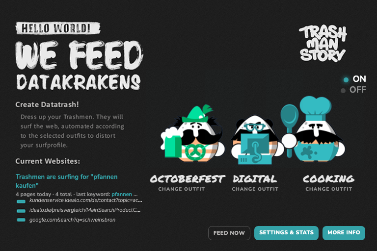

# Trashman Story – We feed datakrakens

A browser extension that sends three "Trashmen" out to surf the web for you.
Every Trashman wears an outfit. Every outfit is a topic. They search for it,
open shops, click through results and leave a trail of data trash. The
advertising trackers eat it, your interest profile gets distorted, and the
data they sell becomes worthless.

Trashman Story does not hide you. It fights back.



## Install

Firefox is the primary target. Chrome, Edge and Brave are supported but we
do not plan to fight Google's review process for an extension whose job is to
annoy Google.

**Firefox, from the release zip:** download `trashmanstory-firefox-<version>.zip`
from the [releases](https://github.com/colorMike/trashman-story/releases), open
`about:addons`, gear icon, *Install Add-on From File…*. (Until the add-on is
signed by Mozilla this only works in Firefox Developer Edition / Nightly with
`xpinstall.signatures.required = false`, or as a temporary add-on below.)

**Firefox, from source:** `npm run build`, then open
`about:debugging#/runtime/this-firefox`, *Load Temporary Add-on…*, and choose
`dist/firefox-src/manifest.json`. Allow access to websites when the popup asks.

**Chrome / Edge / Brave, from source:** open `chrome://extensions`, enable
*Developer mode*, *Load unpacked*, choose the `src` folder.

**From a store:** see [docs/PUBLISHING.md](docs/PUBLISHING.md).

## Use

1. Click the toolbar icon.
2. Click a Trashman to dress him. Three outfits out of 51.
3. Flip the switch to ON. A pinned, muted tab opens. That is their playground.
   Leave it open.
4. Watch the stats in *Settings & Stats* and verify the effect in your
   [Google](https://myadcenter.google.com/), Facebook or Amazon ad settings.

## How it works

```
alarm / timer ──▶ background.js ──▶ decideNext()  ──▶ seed: search on Google / Bing / DDG / Amazon / eBay / idealo / Wikipedia
                       ▲                            └─▶ link: random harvested link, max N hops per site
                       │
                 content.js (only inside the Trashman tab):
                 shows a banner, scrolls a bit, harvests <a href> links, sends them back
```

* **Pacing:** log-uniform jitter between `minDelaySec` and `maxDelaySec`
  (default 25 s – 2 min), so most pauses are short and some are long.
* **Idle:** pauses while you are away from the keyboard (`chrome.idle`).
* **Safety:** never follows links to logout, cart, checkout, login, download,
  unsubscribe, local networks or social networks. Never touches your other tabs.
* **State:** everything lives in `chrome.storage.local`; the service worker may
  die any time and picks up where it left off.

Details in [src/lib/engine.js](src/lib/engine.js), which is pure and tested.

## Develop

```bash
npm test          # unit tests for the engine (node:test, no dependencies)
npm run lint      # syntax check all scripts + validate manifest
npm run build     # dist/trashmanstory-firefox-<v>.zip, -chrome-<v>.zip and dist/firefox-src/
npm run lint:amo  # Mozilla's add-on linter (web-ext) on the Firefox build
```

Tested end-to-end in headless Firefox 156 and Chrome for Testing 151
(install, activate, search, harvest links, follow links, banner, stop).

Layout:

```
src/
  manifest.json        MV3; build.sh derives the Firefox variant (event page, add-on id)
  background.js        service worker: scheduling, tab, stats
  content.js/.css      banner + link harvesting inside the Trashman tab
  lib/engine.js        pure logic: keywords, seeds, link filter, pacing, stats
  data/avatars.js      51 outfits with sprite animation and 726 keywords
  popup/               configurator popup, landing page
  options/             settings & stats
  images/, fonts/      artwork from the original project
store/                 listing texts, screenshot checklist
docs/PUBLISHING.md     how to get it into the Chrome Web Store / AMO / Edge
```

## Why

Trashman Story began in 2014 as a master project by Michael Sedlmeier and
Julian Empl at the University of Applied Sciences Salzburg (MultiMediaTechnology).
The first plugin was written by David Neubauer and Joscha Probst in 2015. It
worked, it was never published. This is the rewrite that gets it out the door.

Related work: [TrackMeNot](https://trackmenot.io) (2006) and
[AdNauseam](https://adnauseam.io) (2014) follow the same idea of obfuscation
instead of blocking.

## Licence

Code: MIT. Artwork, name and logo: © Michael Sedlmeier & Julian Empl, see
[LICENSE](LICENSE). Fonts: see [src/fonts/README.md](src/fonts/README.md).
